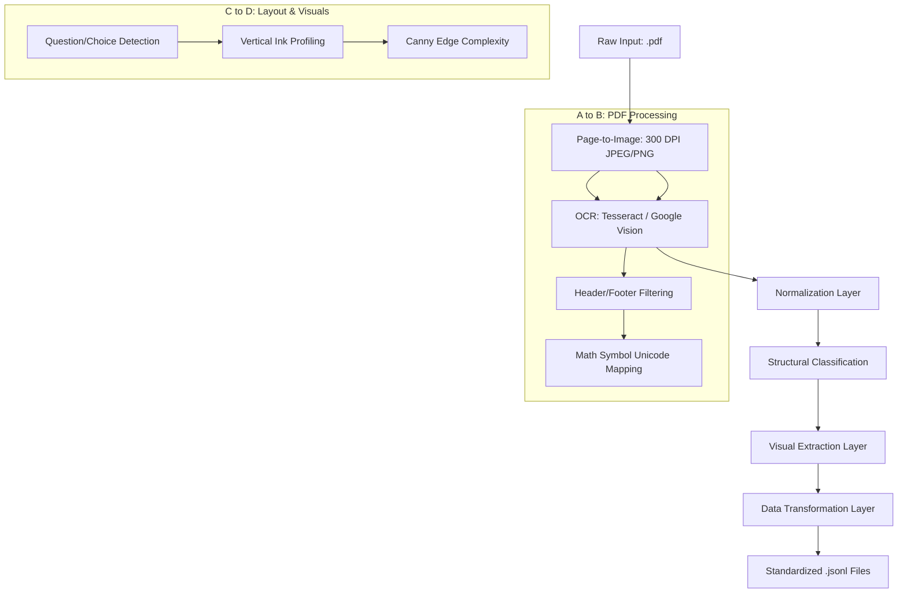

# ITPE Practice Quiz Pipeline

This document details the data transformation pipeline used to convert raw IT Passport Examination PDF materials into standardized, high-fidelity JSONL data for the quiz application.

## 1. Pipeline Overview

---

## 2. Detailed Phase Descriptions

### Phase 0: PDF-to-Text Ingestion (A -> B)
*   **A1: Source Extraction:** Raw examination PDFs are converted into high-resolution images (300 DPI) using **`pdf2image`** (backed by the **`poppler`** library) to ensure OCR accuracy.
*   **A2: OCR Engine:** Images are processed through **`Tesseract OCR`** (using `--oem 3 --psm 6`) or **`Google Cloud Vision`** to extract raw text while preserving spatial layout.
*   **Text Layering:** The resulting raw OCR stream is saved as a standardized `.txt` file, forming the primary text source.

### Phase 1: Normalization (`generate_quiz_jsonl.py`)
*   **Library:** Built using **Python's `re` (Regex)** and **`json`** libraries.
*   **Structural Filtering:** Automatically identifies the end of the front matter by searching for the `--- Page 3 ---` marker.
*   **Symbol Normalization:** Standardizes mathematical and logical operators (Intersection $\cap$, Union $\cup$).

### Phase 2: Classification (`generate_classification_report.py`)
*   **Heuristic Detection:** Analyzes the normalized OCR stream using **Regex** for structural markers like `|`, `[Data]`, and "figure".
*   **Contextual Mapping:** Distinguishes between visuals in the question stem vs. visuals in the choices.

### Phase 3: Visual Extraction (`layout_utils.py`, `image_utils.py`)
*   **Image Processing:** Utilizes **`PIL (Pillow)`** for precise cropping and **`scikit-image`** for advanced layout analysis.
*   **Complexity Scoring:** Employs **Canny Edge detection** (`skimage.feature.canny`) to identify diagrams based on edge density and connected components.

### Phase 4: Transformation & Export (`split_jsonl.py`)
*   **JSON Serialization:** Combines sanitized text, BOK categories, and cropped diagrams into a nested JSON structure.
*   **Chunking:** Splits large sets into 20-question chunks to optimize **Firebase Firestore** and **Firebase Storage** performance.
